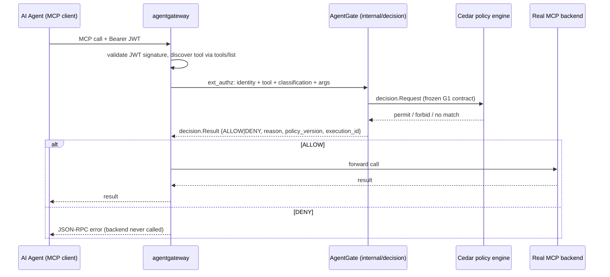
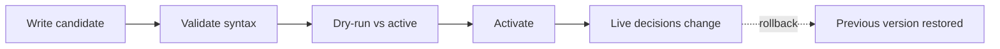

# Admin UI — flow, process, and how the concept maps to reality

This grounds the 14-screen concept mockup against what AgentGate's backend
actually does today (G1–G4, shipped and tested) versus what's documented as
intended-but-not-built (`docs/PROJECT_DEFINITION.md`) versus what the concept
implies that doesn't match the architecture at all. Written before
implementation so scope and a couple of real mismatches are explicit up front,
not discovered halfway through building screens.

## 1. What actually happens at request time (the thing being governed)



This is real and fully built (G1). `decision.Request`/`decision.Result` is the
frozen contract in `docs/PHASES/G1_WORKSTREAMS/GO_BACKEND_G1_CONTRACT.md`, and
`frontend/src/models/decision.ts` + `frontend/src/view/decision-view.ts` are
the typed model and renderer for it — this is what the **Decision Tester**
panel already exercises.

## 2. The policy governance loop (the actual differentiator, per §6 of
   PROJECT_DEFINITION.md)



Also real and fully built (G1–G4), backed by `GovernanceClient`
(`frontend/src/api/governanceClient.ts`) → `cmd/agentgate`'s
`/api/v1/workspaces/{id}/policies/...` REST surface. `MockGovernanceClient`
reproduces the same interface in-memory for dummy-data use.

## 3. Screen-by-screen reality legend

| # | Concept screen | Status | Real backing today | Notes |
|---|---|---|---|---|
| 1 | Dashboard (Home) | 🟡 mock, grounded | Health/readiness endpoints exist; per-decision `reason` codes exist | No aggregation endpoint exists yet (no "24,580 requests, top 5 tools" API). Numbers are generated dummy data shaped like real `ReasonCode`/tool data, not fabricated categories. |
| 2 | Policies List | 🟢 real | `GovernanceClient.listPolicies` | Direct port of what I already built. |
| 3 | Create/Edit Policy | 🟡 reframed | `createCandidate(content)` takes raw Cedar text | See §4 below — concept shows a code editor, which matches *today's* API; the product's stated long-term intent (§6 of PROJECT_DEFINITION.md) is a structured rule builder that compiles to Cedar, which doesn't exist on either side yet. Building raw-Cedar now, flagging the builder as future. |
| 4 | Validation Results | 🟢 real | `validatePolicy` → `ValidateResponse` | Direct port. |
| 5 | Dry Run / Impact Analysis | 🟡 reframed | `dryRunCompare(version, samples)` | Concept shows "compared against last 500 logged decisions" — that would need a *read* API over durable audit history. **Update (2026-09-18):** durable audit storage itself shipped in Gate G5 and is now live-integrated in G6 (`agentgate/internal/audit`, Postgres, SHA-256 row chaining) — it is not "not started." What's still missing is a REST endpoint exposing that store for read (see row 10 below; same gap, one API). Today's contract compares explicit sample requests the operator defines. Showing honest stats over the actual sample set, not a fabricated historical corpus. |
| 6 | Activate Policy | 🟢 real | `activatePolicy` → `ActivateResponse` | Direct port. |
| 7 | Policy History & Rollback | 🟢 real | `listPolicies` (historical state) + `rollbackPolicy` | Direct port. |
| 8/9 | Tools & Resources / Tool Details | 🟡 mock, grounded | `internal/toolregistry` exists in Go; no REST API exposes it yet | **Still accurate as of 2026-09-18** — this has not changed. PROJECT_DEFINITION.md §5a explicitly lists "Tool inventory UI" as required-but-not-built. Real purpose: operator classifies discovered-but-unclassified tools (risk=read/write/destructive) — unclassified today already means deny, per the fixture policy. Mock data shaped to match this real purpose. One added nuance: `internal/toolregistry.Registry` currently only supports `Lookup` by exact tool ID, not enumeration — a future read API needs a `List` method added, not just an HTTP wrapper over an existing one. There is also no dynamic discovery of unclassified tools seen in live traffic; today's registry is a static, startup-loaded fixture list (`cmd/agentgate/main.go`). Tracked as backend work in `docs/PHASES/G7_WORKSTREAMS/01_BACKEND_G7.md`. |
| 10 | Audit / Logs & Detail | 🟡 mock, grounded | `internal/auditevents.MutationListener` exists (in-memory only, G4) | **Update (2026-09-18): the "not-yet-started" framing here is now wrong and should not be repeated.** Durable, queryable audit storage shipped in Gate G5 and is live-integrated as of Gate G6 (`agentgate/internal/audit`: Postgres-backed, SHA-256 tamper-evident row chaining, `ListRecords`/`GetRecordBySequence` already exist as Go methods). **What is still actually missing is only a REST endpoint exposing that store for read** — `internal/govapi` currently has zero audit-related routes (verified by reading `agentgate/internal/govapi/handler.go`; only the 7 policy-lifecycle routes exist). Tracked as backend work in `docs/PHASES/G7_WORKSTREAMS/01_BACKEND_G7.md`; this panel goes real once that endpoint exists and this app wires it (`docs/PHASES/G7_WORKSTREAMS/03_FRONTEND_G7.md`). Mock data shaped like the real `MutationEvent` fields (action, version, workspace, timestamp) plus decision-level fields from the real `AuthorizationResult` shape. |
| 11 | Identities | 🟡 reframed | `internal/identity` reads JWT claims per-call; no identity directory exists | PROJECT_DEFINITION.md is explicit: "Not an identity provider — we consume the customer's existing OIDC." There is no AgentGate-owned user/agent directory to list. Reframed as "identities *seen* in recent activity" (derived from decision/audit data), not a user-management screen. |
| 12 | Settings / Configuration | 🔴 reframed | `internal/config` is env-injected at process start | The concept shows an editable form for DB connection strings, gateway endpoints, TLS. AgentGate's config is startup-time env vars, not runtime-editable — this is a documented invariant (`deploy/g4/README.md`: "production must inject secrets via orchestrator, never...UI"). Rendering a live-editable secrets form would misrepresent the security model. Scoped down to what's actually adjustable from a governance UI: workspace, connection mode (mock/live), admin token. |
| 13 | Login / Authentication | 🔴 reframed | Governance REST API checks a single shared bearer token (`AGENTGATE_ADMIN_TOKEN`, built in G3/G4) | PROJECT_DEFINITION.md lists "Authentication on the admin UI" as an explicit, unbuilt gap, and states AgentGate is deliberately "not an identity provider." An email+password "Sign in" screen would imply a user-account system that isn't planned — real production auth would be OIDC-federated to the customer's IdP. Building a screen that *looks* like it authenticates but doesn't would be actively misleading. Replaced with an admin-token gate, visually similar, honestly labeled as a client-side UX gate (not a security boundary — the real boundary is the backend's bearer-token check, which still applies). |
| 14 | Error / Failure State | 🟢 real | `ApiError` / `apiErrorMessage` (`frontend/src/models/api-error.ts`) | Already built and used by the Decision Tester; extending consistently to every panel. |

Legend: 🟢 real contract, already tested · 🟡 dummy data shaped to match a real, documented (but unbuilt) feature · 🔴 concept conflicts with documented architecture — reframed rather than built as shown.

## 4. Where new dummy data lives (and why it's not in `frontend/src`)

`frontend/src/models` is the frozen G1 contract layer — other workstreams
(Go Backend, Gateway/MCP, QA/Security) read it as the source of truth for
what the wire contract actually is. Tools/Identities/Audit/Dashboard have no
real contract yet, so their mock shapes live entirely under
`admin-ui/src/mock/` — never mixed into `frontend/src/models` — so nothing
built here could be mistaken for a proposed or frozen contract by another
stream. If any of this direction gets adopted for real, that mock shape is a
starting *suggestion* for the Lead Architect to review, not a fait accompli.

## 5. Information architecture

Persistent left sidebar (matches the concept), light content area:

```
Dashboard
Policies        (list → create/validate/dry-run/activate wizard → history/rollback)
Tools & Resources (list → detail/classify)
Identities       (seen-identities list, derived)
Decision Tester   (kept from the existing prototype — exercises the real fail-closed contract directly)
Audit Logs        (list → detail)
Settings          (workspace / connection mode / admin token)
```

Gated behind the admin-token screen on load (cosmetic gate, see §3 row 13).

## 6. What this pass builds

All of the above, as a working React app with dummy data by default (real
`GovernanceClient`/`MockGovernanceClient` wiring kept for Policies; new mock
generators for Tools/Identities/Audit/Dashboard). Visual language: dark
sidebar, light content, status-colored pills, cards — matching the concept's
look rather than the previous dark-theme-everywhere prototype.

Not building in this pass: the structured rule-builder-to-Cedar compiler
(§3 row 3), durable audit replay for dry-run (§3 row 5), or real OIDC login
(§3 row 13) — each requires backend work that doesn't exist yet and is
called out above rather than faked.
