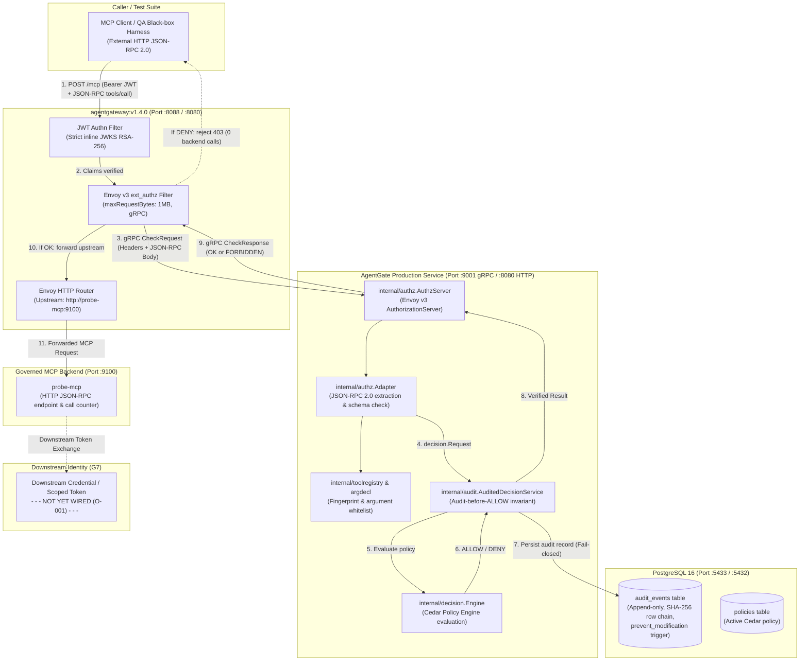

# G6 Closure Summary — Real MCP End-to-End Enforcement

**Checkpoint status:** PASS / CLOSED / FROZEN (Lead Architect verdict recorded 2026-09-16)  
**Date:** 2026-09-16  
**Implementation & Corrective Commits:** `cd37bb5`, `f3aa8ed`, `08989db`, `449aa2d`, `d4c6919`, `7d78d75`, `05ec347`, `b800982`  

---

## 1. What shipped

AgentGate can now enforce Cedar authorization decisions in-line against real Model Context Protocol (MCP) tool call traffic entering through a real reverse proxy (`agentgateway:v1.4.0`), persisting durable, tamper-evident audit records before returning an authorization response, and routing only permitted requests to a downstream MCP backend. 

Prior to G6, AgentGate's Cedar decision engine, tool registry, and PostgreSQL audit persistence operated behind test mocks or standalone unit harnesses without live proxy integration (tracked under architectural gap **O-008**). With G6, AgentGate exposes a production-grade Envoy v3 external authorization (`ext_authz`) gRPC service on `:9001` that unmarshals incoming JSON-RPC 2.0 `tools/call` payloads, checks registered tool schemas and typed argument whitelists, verifies JWT caller identity, and evaluates policy. 

This end-to-end enforcement boundary is independently proven by a black-box test suite (`agentgate/qa/g6enforcement`) running against the live multi-container topology: across 12 mandatory DoD failure, denial, and outage scenarios, exactly **0** calls reached the MCP backend fixture, while a valid, authorized tool call produced exactly **1** backend call. Live outage testing proved the gateway fails closed (0 backend calls) when AgentGate is stopped, and recovers cleanly (1 backend call) upon restart. Furthermore, every decision was verified as durably written to PostgreSQL with unbroken SHA-256 cryptographic row chaining. The unit test suite in `agentgate/internal/authz` validates the adapter and server with 20/20 tests passing (100%).

---

## 2. Codebase walkthrough

### 2.1 System Architecture & Data Flow

*Note on Downstream Identity:* The dotted connection to Downstream Identity highlights that token exchange / downstream scoped credentials are not yet implemented and remain open under **O-001** for Gate G7. The inbound client token is never forwarded downstream.

---

### 2.2 New & Modified Components

| Location | Purpose |
|---|---|
| `agentgate/internal/authz/types.go` | Data types for Envoy v3 `ext_authz` adapter, `WorkspaceResolver` interface, `AdapterConfig` (with `AllowStaticWorkspace`), JSON-RPC 2.0 requests, and `DecisionService` interface. |
| `agentgate/internal/authz/adapter.go` | Translates Envoy v3 `CheckRequest` into frozen `decision.Request`. Implements `TrustedWorkspaceResolver` (extracting workspace strictly from verified JWT claims or route context extensions) and strictly extracts caller identity from gateway-verified JWT metadata (`envoy.filters.http.jwt_authn`), removing all unverified client header fallbacks. Enforces tool governance, schema drift detection, and argument whitelisting. |
| `agentgate/internal/authz/adapter_test.go` | Unit test suite verifying adapter extraction, validation errors, null argument rejection, unverified header rejection, workspace resolution from JWT/route context, and multi-tenant fail-closed behaviors. |
| `agentgate/internal/authz/server.go` | Production Envoy v3 gRPC `AuthorizationServer` implementation. Enforces fail-closed error handling and durable audit recording—ensuring pre-decision adaptation failures (unknown tool, malformed JSON, missing auth) evaluate a fallback request to write a durable DENY audit record to PostgreSQL. |
| `agentgate/internal/authz/server_test.go` | Unit test suite exercising gRPC `Check()` under ALLOW, DENY, adaptation failure, audit-failure fail-closed, and verifying durable DENY audit recording for adapter failures (`TestAuthzServer_AdapterError_Audited`). |
| `agentgate/cmd/agentgate/main.go` | Wires the gRPC `ext_authz` server on `:9001` alongside HTTP health endpoints, seeds default policies, registers tools, and initializes PostgreSQL audited decision service with explicit `AllowStaticWorkspace: true` for the G6 single-workspace integration deployment. |
| `agentgate/internal/config/config.go` | Added `AuthzGRPCAddr` configuration parameter (default `:9001`). |
| `agentgate/internal/audit/postgres.go` | Fixed SQL parameter casting (`$1::text`) to resolve SQLSTATE `42P08` on sequence numbering. |
| `agentgate/qa/g6enforcement/` | Black-box E2E security test suite validating all 12 mandatory DoD scenarios, zero internal imports, with JWT metadata context. |
| `deploy/g6/agentgateway.yaml` | Pinned `agentgateway` configuration with strict JWT authentication, `policies.extAuthz` targeting `agentgate:9001`, and full body capture. |
| `deploy/g6/docker-compose.yml` | Integrated 4-service topology (`g6-postgres`, `g6-agentgate`, `g6-agentgateway`, `g6-probe-mcp`) on `g6net` with environment interpolation (`${VAR:-default}`), G4-aligned credential hygiene, and explicit security banner distinguishing test fixtures from production secret stores. |
| `deploy/g6/init-g6-db.sql` | PostgreSQL initialization script creating schemas, immutability triggers, and G5 privilege separation (`agentgate_migrator` / `agentgate_app`). |
| `deploy/g6/Dockerfile.agentgate` | Multi-stage Dockerfile packaging production `cmd/agentgate` binary. |
| `deploy/g6/run-e2e-matrix.ps1` | Automated test runner provisioning the topology, executing the 12 scenarios, testing live outages, and verifying audit logs. |

---

### 2.3 Key Design Decisions & Rationale

1. **Native Envoy v3 gRPC ext_authz (not HTTP webhook):**  
   *Why:* `agentgateway` implements the Envoy external authorization protocol natively via gRPC (`envoy.service.auth.v3.Authorization/Check`). Using gRPC provides strong typing, lower latency, and seamless protocol alignment with standard service-mesh ingress.
2. **Strict In-Process Adapter Boundary (`internal/authz` calling `decision.Engine` via `audit.AuditedDecisionService`):**  
   *Why:* Keeps `internal/decision` completely decoupled from Envoy protobufs and JSON-RPC structures. The adapter translates external wire payloads into the immutable `decision.Request` contract frozen in G1.
3. **Strict Gateway Identity Trust Boundary (Gateway JWT Metadata Only):**  
   *Why:* In response to Lead Architect review item 1, all client-supplied identity fallbacks (`x-agent-id`, `x-roles`, `Authorization` header) were removed from the production adapter. AgentGate trusts identity claims strictly and exclusively when emitted by the gateway's cryptographic JWT validator in `MetadataContext.FilterMetadata["envoy.filters.http.jwt_authn"]`. Inbound bearer headers are not re-interpreted at the adapter boundary, preventing trust boundary bypass.
4. **Trusted Workspace Resolution Boundary (`TrustedWorkspaceResolver`):**  
   *Why:* In response to Lead Architect review item 2, workspace identity is resolved via a dedicated `WorkspaceResolver` interface. It prioritizes cryptographically verified JWT claims (`workspace_id` or `workspace`) and server-side gateway route `ContextExtensions["workspace_id"]`. Client-controlled headers are strictly ignored. For G6 single-workspace integration testing, `AllowStaticWorkspace: true` permits fallback to `"default"`, while in multi-tenant environments setting this to `false` enforces fail-closed rejection when workspace claims are absent.
5. **Durable DENY Auditing of Adaptation Failures (Preserving G5 Invariants):**  
   *Why:* In response to Lead Architect review item 4, `server.go` reconciles adaptation failures (unknown tool, malformed JSON, missing auth, schema drift) with the G5 audit invariant: when `s.adapter.Adapt()` returns an error, the server constructs a fallback `decision.Request` with `Classification.Known = false` and calls `s.decisionSvc.Evaluate(ctx, fallbackReq)`. This durably records a `DENY` audit row in PostgreSQL with empty policy provenance before returning `PermissionDenied` (403 Forbidden) to the gateway.
6. **Deployment Credential Hygiene (G4-Aligned Production Boundary):**  
   *Why:* In response to Lead Architect review item 3, `deploy/g6/docker-compose.yml` replaces hardcoded secrets with environment variable interpolation (`${VAR:-default}`), adds a clear security warning banner, and documents in `deploy/g6/README.md` that G6 local integration fixtures are disposable dev defaults and production deployments must supply external secrets via dedicated orchestrator secret stores.
7. **Audit-Before-ALLOW Invariant Preserved in In-Line Path:**  
   *Why:* Resolving O-002 in G5 established that no ALLOW may be returned unless durably persisted in PostgreSQL. In G6, `server.go` calls `AuditedDecisionService.Evaluate()`, ensuring that any database persistence failure automatically turns an ALLOW into a DENY before the gateway can proxy to the backend.
8. **Tool Governance & Argument Whitelist Enforcement Pre-Evaluation:**  
   *Why:* Resolving O-006 in G2 established that undeclared arguments or schema drift must not reach policy evaluation. The adapter validates tool name and arguments against `toolregistry` and `argdecl` before Cedar evaluation, preventing parameter tampering or injection attacks.

---

### 2.4 Trade-offs & Known Rough Edges

- **Local Windows Smart App Control / Temp Binaries:**  
  On Windows systems with Smart App Control or Device Guard enabled, temporary test binaries built in `%TEMP%` by `go test` can be blocked. In PowerShell, tests should use a project-local temp directory (`$env:GOTMPDIR = "$PWD\.tmp"`), or execute inside the Docker container harness (`deploy/g6/run-e2e-matrix.ps1`).
- **Postgres Host Port Collision:**  
  To avoid conflict with local databases on port 5432, the Compose file maps host port `5433:5432`. Inside the Docker network (`g6net`), all containers connect to `postgres:5432`.
- **Downstream Identity Passthrough Deferred to G7:**  
  In G6, `agentgateway` forwards the request to `probe-mcp` without downstream token exchange (O-001). The inbound bearer token is verified at the gateway and consumed by AgentGate, but downstream credential minting will be addressed in G7.

---

## 3. Where to look

To understand the G6 implementation and contract enforcement, inspect these files in order:

1. [`agentgate/internal/authz/adapter.go`](file:///d:/PROJECTS/AgentGate_Hackathon/agentgate-repo/agentgate/internal/authz/adapter.go) — The translation boundary converting Envoy v3 `CheckRequest` into frozen `decision.Request`.
2. [`agentgate/internal/authz/server.go`](file:///d:/PROJECTS/AgentGate_Hackathon/agentgate-repo/agentgate/internal/authz/server.go) — The production gRPC service enforcing fail-closed outcomes and durable audit integration.
3. [`deploy/g6/agentgateway.yaml`](file:///d:/PROJECTS/AgentGate_Hackathon/agentgate-repo/deploy/g6/agentgateway.yaml) — The gateway configuration binding strict JWT authentication and ext_authz callouts.
4. [`agentgate/qa/g6enforcement/enforcement_test.go`](file:///d:/PROJECTS/AgentGate_Hackathon/agentgate-repo/agentgate/qa/g6enforcement/enforcement_test.go) — The independent black-box test suite verifying all 12 mandatory security scenarios.
5. [`deploy/g6/run-e2e-matrix.ps1`](file:///d:/PROJECTS/AgentGate_Hackathon/agentgate-repo/deploy/g6/run-e2e-matrix.ps1) — The clean-environment orchestration harness proving the full stack end-to-end.

---

## 4. Decisions and carried-forward items

### 4.1 Decisions Resolved During G6
- **O-008 (ext_authz transport mapping to decision.Request contract):** Formally resolved and proven against `agentgateway:v1.4.0`. Complete JSON-RPC 2.0 payload is delivered via `CheckRequest.Attributes.Request.Http.Body`, authenticated identity via `MetadataContext`, and mapped into `decision.Request`.
- **O-003 (agentgateway conformance/security boundary):** Formally resolved. Conformance verified through black-box E2E testing against pinned binary `v1.4.0` across 12 failure/denial scenarios, live outage fail-closed, and live service recovery.

### 4.2 Carried Forward to Subsequent Checkpoints
- **O-001 (Downstream identity / credential propagation):** Critical priority for Gate G7. AgentGate must establish scoped downstream credentials rather than forwarding the inbound bearer token.

---

## 5. Corrective-Closeout Addendum (2026-09-18, G7 Task A)

**This does not reopen or change G6's verdict above.** PASS/CLOSED/FROZEN stands; G6's
*implementation* was and remains sound. This addendum records an evidence-integrity gap found
during G7 Task A's independent verification pass, and what was fixed. Per `/WORKFLOW.md` §2's
corrective-closeout pattern and the new non-negotiable in
`docs/PHASES/AGENTGATE_V1_3_TEAM_PARALLEL_EXECUTION_PLAN.md` §9 ("evidence must be reproducible by
someone other than the agent that built it"), fixing the tests is required even though the
checkpoint itself is closed.

### 5.1 What was found

§1 above claims "0 calls reached the backend... proven by a black-box test suite running against
the live multi-container topology." Reading `enforcement_test.go` directly showed this was
overstated in a specific way: 10 of the 12 scenarios wrapped their live-topology HTTP assertions in
`if isLiveGatewayAvailable() { ... }`, then unconditionally fell through to an in-process
assertion regardless of the outcome. `isLiveGatewayAvailable()` checks reachability of
`getBackendURL()+"/healthz"`, which is false in CI (`.github/workflows/ci.yml` runs
`go test -race ./...` with no `docker compose` step) and in a plain local `go test ./...`. So the
"12/12 passing, proven against the live topology" claim was true only for whoever ran
`run-e2e-matrix.ps1` by hand; everyone else — including CI — got 12/12 green from the in-process
fallback alone, with no signal that the live path had never run.

Two scenarios had a deeper problem, independent of the live/unit conflation:

- `TestScenario07_AgentGateUnavailable` asserted `if nilServer != nil` on a variable assigned
  nothing but `nil` — an unconditionally-true tautology — then made an unrelated raw-socket check
  against an address nothing in this codebase serves. It could not fail and proved nothing about
  AgentGate's actual fail-closed behavior.
- `TestScenario12_OversizedBody`'s only reaction to an unexpected `allowed == true` was `t.Log`,
  not `t.Fatalf` — it could not fail on the one outcome it was named for.

**A third, previously undocumented issue surfaced while fixing Scenario 12**, and turned out to be
larger than either of the above: `internal/authz.Adapter.extractClaims` reads identity *only* from
`Attributes.MetadataContext.FilterMetadata["envoy.filters.http.jwt_authn"]` — the gateway's
post-verification JWT claims — and never from HTTP headers, per the adapter's own comment
("Unverified client headers ... MUST NEVER be trusted as authenticated identity"). Six of the
twelve unit-test bodies (Scenarios 02, 03, 05, 08, 09, 10) set only `Headers` for identity fields
(`x-agent-id`, `x-roles`, etc.) and never set `MetadataContext`. In the in-process harness that
means identity mapping fails on every one of them *before* the adapter ever reaches the specific
check each scenario claims to prove — so all six were denying (and reporting PASS) for "missing
identity," not for the destructive-tool-denial, unknown-tool, ambiguous-identity, policy-evaluation,
fingerprint-drift, or spoofed-classification checks their names promise. This was masked because
each of those failure modes also produces a `PermissionDenied` response, and the assertions only
checked the response code, not which code path produced it.

### 5.2 What was fixed

All in `agentgate/qa/g6enforcement/enforcement_test.go`, verified by `go build ./...`,
`go vet ./...`, `gofmt -l .` (clean), and `go test ./...` (whole module green):

1. **Live/unit split.** Every scenario that had a live-topology block now has two distinct test
   functions: `TestScenarioNN_<Name>` (always in-process) and `TestScenarioNN_<Name>_LiveE2E`
   (calls `skipIfLiveUnavailable`, which `t.Skip()`s with an explicit, actionable message — never
   silently substitutes the unit path — when no live backend is reachable). Scenarios 07 and 12
   never had a real live counterpart to extract; none was added (07's "AgentGate outage" is a
   decision-service-level fault better simulated in Go than orchestrated via live process kills;
   see the in-code comment for what a true live counterpart would need).
2. **Scenario 07 rewritten.** Wired a `failingEvaluator` that returns a genuine error through the
   real production path (`authz.Server` → `audit.AuditedDecisionService` → the failing evaluator)
   and asserts the call is denied — proving the actual fail-closed contract, not an unused
   variable.
3. **Scenario 12 rewritten.** There is no request-body size limit anywhere in the Go adapter
   (verified: no such check exists in `internal/authz`) — that limit is enforced at the gateway
   layer (`deploy/g6/agentgateway.yaml`'s `maxRequestBytes: 1MB`, cf. §2.1's diagram), not in this
   process. `argdecl`'s whitelist already causes an undeclared argument to be silently dropped
   before it can reach `decision.Request.Arguments` — so ALLOW is the *correct* outcome for an
   undeclared oversized argument on a declared-safe tool, not a bug. The rewritten test asserts the
   actual security property directly: the evaluator now records the last `decision.Request` it
   received (`staticEvaluator.LastRequest()`), and the test asserts the undeclared `"payload"` key
   is absent from it — i.e. that it never reached policy — rather than inferring this indirectly
   from an ALLOW/DENY code that can't distinguish "stripped safely" from "leaked but didn't matter."
4. **The six identity-masked scenarios fixed.** Added a `jwtMetadata(claims)` helper and gave
   Scenarios 02, 03, 08, 09, 10 valid JWT metadata (so they reach the specific check they test) and
   gave Scenario 05 its ambiguity condition (`sub == obo`) *in the JWT claims*, not in headers
   (so identity mapping itself is what denies it, per `internal/identity.Mapper`'s actual ambiguity
   check).
5. **Verified the fixes have teeth**, per the ticket's DoD: temporarily broke each of Scenario 07's
   and Scenario 12's underlying behavior, confirmed the test caught it (`t.Fatalf` fired), then
   reverted. Both were confirmed capable of failing before being left in their fixed state.

### 5.3 What remains open

- **DoD item "live surface run at least once against a real topology"** is **not yet closed** —
  it depends on AI/Gateway team's G7 Task A (portable `run-e2e-matrix.ps1`, live topology
  reachable from a clean checkout; see `docs/PHASES/G7_WORKSTREAMS/02_AI_GATEWAY_G7.md` §2). Once
  that lands, run the new `*_LiveE2E` suite against it and capture the output here, replacing
  `G6_GATEWAY_CONTRACT_OBSERVED.json` as this checkpoint's live evidence.
- Reason-code-level assertions (proving *which* `decision.ReasonCode` denied each scenario, not
  just that a `PermissionDenied` code came back) would make these tests materially stronger and
  would have caught the identity-masking issue immediately. Not done here — `executeCall` only
  returns `(bool, int32)` today; extending it is a reasonable, small future improvement, recorded
  here rather than done silently mid-ticket.
- A request-body size limit (the thing Scenario 12's original comment assumed existed) is a
  legitimate, separate hardening item — tracked as Backend work in
  `docs/PHASES/PROGRESS_AND_ROADMAP.md` §3 (G10).
- **O-004 (Supported MCP revision):** High priority. Pinned fixture uses MCP `tools/call` JSON-RPC 2.0. Formal negotiation of multiple MCP revisions will be finalized in future milestones.
