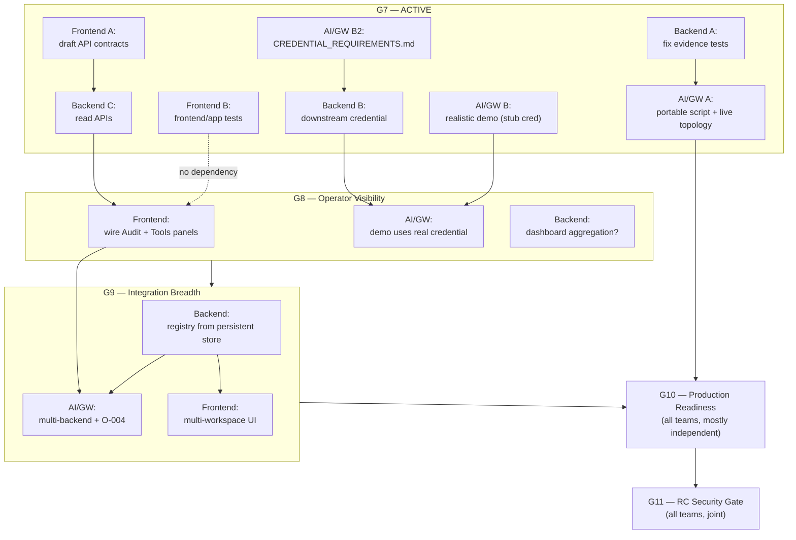

# AgentGate — Progress Tracker & Roadmap

**What this file is:** the single place to answer "what's done, what's in flight, what's next, and
who's blocked on whom." One checkpoint per section, each broken down by team, each task marked
**IND** (can be done independently) or **DEP** (needs another team first, named explicitly).

**What this file is not:** a replacement for the per-checkpoint tickets. When a checkpoint is
active, its tickets in `docs/PHASES/G{N}_WORKSTREAMS/` are what teams actually execute — this file
says *what and when*, the tickets say *exactly how*.

**Update rule:** rewrite in place when a checkpoint opens, a task completes, or scope moves between
checkpoints. Do not append a changelog here — checkpoint history lives in each checkpoint's own
`CLOSURE_SUMMARY.md`. Do not mark anything ✅ that hasn't actually been verified by someone other
than whoever built it (`AGENTGATE_V1_3_TEAM_PARALLEL_EXECUTION_PLAN.md` §9).

**Last updated:** 2026-09-18

---

## 0. At a glance

| # | Checkpoint | Status | Date | Teams active | Proves |
|---|---|---|---|---|---|
| — | Phase 0 — Repository & CI baseline | ✅ COMPLETE | 2026-08-22 → 09-09 | — | The repo can build, test, and govern itself |
| — | Day 1 — Security invariants & architecture freeze | ✅ COMPLETE | 2026-09-09 | — | What "secure" means here is written down and binding |
| — | Day 2 — Decision core productionization | ✅ COMPLETE | 2026-09-10 | — | A real Cedar decision, fail-closed, exists |
| G1 | Authorization Contract Freeze | ✅ COMPLETE | 2026-09-12 | 5 (old model) | One agreed request/result contract everyone builds against |
| G2 | Identity + Tool Governance Boundary | ✅ COMPLETE | 2026-09-13 | 5 (old model) | Who you are and what tool you're calling can't be spoofed |
| G3 | Policy Persistence + Governance API | ✅ COMPLETE | 2026-09-13 | 5 (old model) | Policy survives restarts, is versioned, has an admin API |
| G4 | Governance Workflow Integration | ✅ COMPLETE | 2026-09-14 | 5 (old model) | Candidate → validate → dry-run → activate → rollback works |
| G5 | Durable Audit Boundary | ✅ COMPLETE | 2026-09-14 | 5 (old model) | No ALLOW without a durable, tamper-evident audit record |
| G6 | Real MCP End-to-End Enforcement | ✅ COMPLETE ⚠️ | 2026-09-16 | 5 (old model) | Real MCP traffic through a real gateway is really enforced |
| — | Restructure: 3-team model + admin-ui intake, then consolidation | ✅ COMPLETE | 2026-09-18 | — | Teams can work independently; one UI (frontend/app/) is in the repo, honestly documented |
| **G7** | **Evidence, Downstream Identity & Read Surface** | 🔵 **ACTIVE** | opened 2026-09-18 | **All 3** | The enforcement claim is reproducible; downstream calls are properly credentialed |
| G8 | Operator Visibility Complete | ⬜ PLANNED | — | All 3 | An operator sees *real* system state in the UI, not mock data |
| G9 | Integration Breadth | ⬜ PLANNED | — | All 3 | AgentGate isn't hardcoded to one backend/one scenario |
| G10 | Production Environment Readiness | ⬜ PLANNED | — | All 3 | It deploys, observes, recovers — from a clean environment |
| G11 | Release Candidate Security Gate | ⬜ PLANNED | — | All 3 | Nothing critical/high is open; it's shippable |
| — | Public launch backlog | 🗄️ UNSCHEDULED | — | Frontend + Lead | Docs site, landing page, license, repo move |

⚠️ **G6 caveat:** the implementation is real and sound; its *end-to-end evidence* was overstated
(tests silently fell back to in-process calls; two tests couldn't fail). Being corrected in G7,
Task A — see `docs/PHASES/G7_WORKSTREAMS/01_BACKEND_G7.md` §2. G6's verdict is not reopened; this
is corrective closeout.

**Numbering note:** the superseded 10-day plan's Gate G8 (Production Environment Readiness) and
Gate G9 (Release Candidate Security Gate) are this roadmap's **G10** and **G11** — same
definitions of done, renumbered because G8/G9 here are new checkpoints that plan never had. The
original DoD tables are still authoritative for those two and are carried forward verbatim below.

---

## 1. Completed

### Phase 0 — Repository & CI baseline ✅
**Completed:** 2026-08-22 → 2026-09-09
- Repository reconnaissance, CI baseline (`gofmt`/`vet`/`build`/`test -race`/`golangci-lint`/`govulncheck`), Go module scaffold (`github.com/Dynamisch-LLC/agentgate`, Go 1.26).
- Artifacts: `.github/workflows/ci.yml`, `docs/DEVELOPMENT/CI_BASELINE.md`, `docs/PHASES/archive/REPOSITORY_BASELINE.md`.

### Day 1 — Production security invariants & architecture freeze ✅
**Completed:** 2026-09-09 · Spec: `docs/PHASES/DAY-01-TASK-01.md`
- Produced `docs/SECURITY/PRODUCTION-INVARIANTS.md` — still binding on every checkpoint since.

### Day 2 — Decision core productionization ✅
**Completed:** 2026-09-10 · Spec: `docs/PHASES/DAY-02-TASK-02.md`
- `internal/decision` + `internal/policy` (the only package importing `cedar-go`).

### G1 — Authorization Contract Freeze ✅
**Closed:** 2026-09-12 · `docs/PHASES/G1_WORKSTREAMS/CLOSURE_SUMMARY.md`
- Frozen `decision.Request`/`decision.Result`; `GO_BACKEND_G1_CONTRACT.md`; 37-test independent black-box suite; agentgateway config schema-validated against the real binary.
- Two real bugs found and fixed (JSON `null` coerced to zero value; `omitempty` dropping contract fields).

### G2 — Identity + Tool Governance Boundary ✅
**Closed:** 2026-09-13 · `docs/PHASES/G2_WORKSTREAMS/G2_CLOSURE_SUMMARY.md`
- `internal/identity` (fail-closed claims mapping), `internal/toolregistry` (SHA-256 schema fingerprinting + drift detection), `internal/argdecl` (typed argument whitelist — resolved **O-006**), `internal/contextassembly`.
- Resolved **O-005** (tool fingerprinting), **O-006** (argument model), **O-007** (execution identity).

### G3 — Policy Persistence + Governance API ✅
**Closed:** 2026-09-13 · `docs/PHASES/G3_WORKSTREAMS/G3_CLOSURE_SUMMARY.md`
- `internal/policystore` (Memory + PostgreSQL, one shared behavior test), `internal/policymanager` (content-addressed versions, atomic activation, rollback, preview), `internal/govapi` (7 admin REST routes at the time; an 8th, `/dryrun`, was added in G4 — 8 today, all under `/policies`), constant-time token auth, `deploy/g3`.

### G4 — Governance Workflow Integration ✅
**Closed:** 2026-09-14 · `docs/PHASES/G4_WORKSTREAMS/CLOSURE_SUMMARY.md`
- `internal/auditevents`, `internal/governanceintegration` (candidate-vs-active dry-run compare), `POST .../policies/{version}/dryrun`, frontend dry-run models/views, `deploy/g4`.

### G5 — Durable Audit Boundary ✅
**Closed:** 2026-09-14 · `docs/PHASES/G5_WORKSTREAMS/CLOSURE_SUMMARY.md`
- `internal/audit`: append-only Postgres `audit_events`, SHA-256 `prev_hash`/`row_hash` chaining, independent `ChainVerifier`, pre-persistence redaction, DB immutability trigger, privilege separation (`agentgate_app` vs `agentgate_migrator`).
- Resolved **O-002** (audit durability — audit failure forces DENY).

### G6 — Real MCP End-to-End Enforcement ✅ ⚠️
**Closed:** 2026-09-16 · `docs/PHASES/G6_WORKSTREAMS/CLOSURE_SUMMARY.md`
- `internal/authz`: real Envoy v3 `ext_authz` gRPC service on `:9001`, JSON-RPC 2.0 `tools/call` adapter, gateway-JWT-only identity trust, `TrustedWorkspaceResolver`, durable DENY auditing of adaptation failures. Live `agentgateway:v1.4.0` integration, `deploy/g6` 4-service topology.
- Resolved **O-003** (gateway conformance), **O-008** (ext_authz transport mapping).
- ⚠️ **Evidence gap, being corrected in G7 Task A** — see the caveat in §0.

### Restructure — 3-team model + admin-ui intake ✅
**Completed:** 2026-09-18
- `admin-ui/` merged (PR #3, teammate's independent fork). 5-workstream model superseded by the 3-team model (`AGENTGATE_V1_3_TEAM_PARALLEL_EXECUTION_PLAN.md`).
- Independent verification pass found and documented G6's evidence gap; corrected false claims in `CURRENT_STATUS.md` (QA-suite independence) and `SETUP.md` (3 subsystems described as unbuilt that were fully built); corrected `admin-ui`'s stale mock-vs-real reasoning and its overstated test-coverage claim.
- **O-009** opened (is `admin-ui` the production UI?). New standing non-negotiable: evidence must be reproducible by someone other than its author.
- **Superseded same day:** a second teammate independently built a second admin UI, `frontend/app/`
  (PR #5/#6), without pulling the `admin-ui/` merge first. `admin-ui/` was removed and
  `frontend/app/` kept (O-009 resolved) — see the entry below.

### Consolidation — two competing admin UIs, one kept ✅
**Completed:** 2026-09-18
- `admin-ui/` (this session's earlier restructure) and `frontend/app/` (a different teammate's
  independent PR #5/#6) both existed in `development` simultaneously — the exact silent-drift risk
  O-009 was recorded to flag.
- **O-009 resolved:** `frontend/app/` kept (already had committed Vitest coverage and its own
  `PROPOSED_G8_API_CONTRACTS.md`); `admin-ui/` removed. Not a quality judgment — a
  further-along-wins consolidation call.
- `docs/PHASES/G7_WORKSTREAMS/03_FRONTEND_G7.md` retargeted to `frontend/app/`; Tasks A and B
  found to be already substantially satisfied there (contracts doc + 4 real test files existed
  before the retarget).
- All durable docs referencing `admin-ui/` updated: `CURRENT_STATUS.md`, `SETUP.md`,
  `BRANCHING_AND_MERGING.md`, `AGENTGATE_V1_3_TEAM_PARALLEL_EXECUTION_PLAN.md` (old §3 kept as a
  collapsed historical record, not deleted), this file.

---

## 2. 🔵 ACTIVE — G7: Evidence, Downstream Identity & Read Surface

**Opened:** 2026-09-18 · **Tickets:** `docs/PHASES/G7_WORKSTREAMS/`
**Proves:** the enforcement claim holds up when someone else runs it, and a real downstream call
carries a real, scoped credential — not the caller's token.
**Resolves:** O-001.

### Backend — `01_BACKEND_G7.md`
| | Task | Type | Notes |
|---|---|---|---|
| ⬜ | **A. G6 evidence closeout** — fix `TestScenario07` (tautology), `TestScenario12` (can't fail on wrong ALLOW), split live-E2E from in-process unit path so live skips *loudly* | **IND** to write · **DEP** to verify | Verification step needs AI/Gateway's live topology (their Task A) |
| ⬜ | **B. Downstream scoped credential** (O-001) — new boundary (e.g. `internal/credential`), invoked only after ALLOW; no raw bearer passthrough; issuance failure → DENY; identity stays auditable | **DEP** | Design now; **implementation blocked on AI/Gateway's backend + credential-model choice** (their Task B, second half) |
| ✅ | **C. Governance read-surface** — `GET .../audit-events` and `GET .../tools`, implemented to Frontend's own reviewed proposal (`frontend/app/PROPOSED_G8_API_CONTRACTS.md`); `Registry.List()` and `Store.ListRecordsBefore` added; tests cover auth, pagination, empty-result, chain-field exclusion, limit capping | **IND** to build · **DEP** to freeze | Frontend confirming they reviewed *this implementation* (not just their own proposal) is what turns "implemented to spec" into "frozen" — see `GO_BACKEND_G7_READ_API_CONTRACT.md` |

### AI / Gateway — `02_AI_GATEWAY_G7.md`
| | Task | Type | Notes |
|---|---|---|---|
| ⬜ | **A. G6 evidence closeout, environment half** — fix the hardcoded absolute path in `run-e2e-matrix.ps1` (line 10); stand up `deploy/g6` cleanly; run Backend's corrected live suite once and capture real evidence | **IND** to fix · **DEP** to run | Running the suite needs Backend's Task A fix merged |
| ⬜ | **B. Realistic demonstration system** — pick a real/realistic MCP backend, build additive `deploy/demo/` (do not touch `deploy/g6`), ≥1 `write`/`destructive` tool whose allow/deny visibly changes with a real policy activation | **IND** | Use a stub credential meanwhile — do not wait for Backend |
| ⬜ | **B2. Hand `CREDENTIAL_REQUIREMENTS.md` to Backend** | **IND** — but **others depend on you** | ⚠️ **Backend's Task B implementation is blocked until this lands. Do it early.** |

### Frontend — `03_FRONTEND_G7.md` (retargeted 2026-09-18 from `admin-ui/` to `frontend/app/`, see O-009)
| | Task | Type | Notes |
|---|---|---|---|
| ✅ | **A. Draft both read-API contracts** for Backend to review | **IND** — but **others depend on you** | Already done: `frontend/app/PROPOSED_G8_API_CONTRACTS.md`. ⚠️ Confirm Backend actually reviewed *this* file |
| ✅ | **B. Automated test coverage** for the real panels; `test` script | **IND** | Already substantially done: `frontend/app` has `npm test` + 4 real test files (policy lifecycle, activation-pending guard, decision fixtures). No separate Decision Tester screen exists — fixtures are tested directly instead; treated as an acceptable equivalent, not a gap |
| ⬜ | **C. Continued `frontend/app/` development** | **IND** | Do **not** wire Audit/Tools pages yet — that's G8 |
| ⬜ | **D. Write the real-vs-mock accounting `frontend/app/` lacks** | **IND** | `admin-ui/` had one (`FLOW_AND_ARCHITECTURE.md`); `frontend/app/` doesn't yet — use the old one as a rigor model, not content |

### G7 exit criteria
- [x] Both fixed tests can genuinely fail (verified by deliberately breaking the behavior, then reverting).
- [ ] Live E2E suite has actually run against a real topology, output captured, replacing the one-time manual capture.
- [ ] A real downstream credential (≠ inbound token) reaches a real backend on ALLOW; issuance failure denies.
- [x] Both read endpoints exist, are read-only, implemented to Frontend's reviewed proposal, and documented (`GO_BACKEND_G7_READ_API_CONTRACT.md`). Pending: Frontend's explicit sign-off on the *implementation* (not just their own proposal) before calling it frozen.
- [x] `frontend/app` has committed, re-runnable tests for its real panels.
- [x] Corrective-closeout addendum added to G6's `CLOSURE_SUMMARY.md`.

---

## 3. ⬜ PLANNED

### G8 — Operator Visibility Complete
**Proves:** an operator sees and governs *real* system state through the UI — the last mock panels
become real. **Depends on:** G7 Task B (credential) + G7 Task C (read APIs) landing.
**Collaboration level: HIGH** — this is where all three teams converge.

| Team | Task | Type |
|---|---|---|
| Frontend | Wire Audit Logs panel → real audit-query API; wire Tools & Resources → real tool API; flip 🟡→🟢 in `FLOW_AND_ARCHITECTURE.md` only once actually live | **DEP** on Backend G7 Task C |
| Frontend | Extend test coverage to the newly-real panels | **IND** (after the wiring above) |
| Backend | **Decision first, then build:** does the Dashboard get a real aggregation API (request volume, top tools, decision breakdown)? None exists today — the panel is mock for that reason. Either build it or keep the panel honestly mock; do not let the UI imply data that isn't there | **IND** — but needs a scope ruling before building |
| Backend | Support Frontend integration defects found during wiring | **DEP** (reactive) |
| AI/Gateway | Swap the demo system's stub credential for Backend's real G7 mechanism | **DEP** on Backend G7 Task B |
| AI/Gateway | Make the demo generate real traffic → real audit rows, so the UI has genuine data to display | **IND** (after the swap) |

**Exit criteria:** every frontend/app panel is either backed by a real API or explicitly and visibly
labelled as not-yet-backed; no panel implies data the backend doesn't have; the demo system
produces real audit rows visible in the real UI.

### G9 — Integration Breadth
**Proves:** AgentGate governs more than one hardcoded scenario.
**Depends on:** G8 (a working demo + visible operator surface to extend).
**Collaboration level: MEDIUM** — Backend unblocks AI/Gateway, Frontend trails independently.

| Team | Task | Type |
|---|---|---|
| Backend | **Replace the hardcoded tool registry.** `cmd/agentgate/main.go` builds the registry from a literal `[]RegistryEntry{...}` at startup; `toolregistry`'s own comment says G3+ would load from a persistent store — that never happened. Multi-backend cannot work until it does | **IND** — blocks AI/Gateway below |
| Backend | Implement whatever **O-004** (supported MCP revision matrix) resolves to | **DEP** on the O-004 ruling |
| AI/Gateway | Multi-backend topology: 2+ distinct MCP backends behind one gateway, governed independently | **DEP** on Backend's registry work |
| AI/Gateway | **Resolve O-004 empirically** — test which MCP revisions the pinned gateway + our adapter actually accept, then propose the supported boundary | **IND** |
| AI/Gateway | **Integration-point discovery** — document additional plausible integration surfaces (other agent frameworks, other identity providers, other proxies) as *candidate future scope*, recorded in `OPEN_DECISIONS.md`, not silently built | **IND** |
| Frontend | Multi-backend/multi-workspace UI (today the UI defaults to a single `default-workspace`) | **DEP** on Backend's registry work |

**Exit criteria:** two distinct backends governed by distinct policy through one gateway; O-004
closed with a stated supported-revision boundary; integration-point candidates documented, not
half-built.

### G10 — Production Environment Readiness
*(= the superseded 10-day plan's Gate G8 — DoD carried forward verbatim.)*
**Proves:** from a clean environment: images build, config is injected securely, migrations run,
services become ready, a client connects, enforcement happens, audit persists, telemetry is
emitted, restart/recovery works, no hidden manual configuration is required.
**Collaboration level: MEDIUM.**

| Team | Task | Type |
|---|---|---|
| Backend | TLS/mTLS configuration | **IND** |
| Backend | Request size + time limits; rate limiting | **IND** |
| Backend | OpenTelemetry tracing + metrics export | **IND** |
| Backend | Secrets injection — no default/fallback credentials in any production path (today `deploy/g6` uses `${VAR:-default}` dev fixtures, correctly flagged as non-production) | **IND** |
| Backend | Defined behavior under dependency failure (DB down, gateway down) + concurrency correctness under load | **IND** |
| AI/Gateway | Production deployment manifests; migration execution path | **IND** |
| AI/Gateway | CI job running integration tests against a real topology (the thing G7 Task A proves is possible) | **DEP** on G7 Task A |
| AI/Gateway | SBOM, image signing, reproducible release build | **IND** |
| AI/Gateway | Backup/recovery procedure + deployment rollback procedure, both demonstrated | **IND** |
| AI/Gateway | Operator runbook + clean-room deployment script | **IND** |
| Frontend | Production build hardening; explicit error/stale states everywhere | **IND** |
| Frontend | **Real admin authentication** — today's admin-token gate is explicitly *not* a security boundary. Production needs OIDC federation. Touches O-009 | **DEP** on an O-009 ruling |

### G11 — Release Candidate Security Gate
*(= the superseded 10-day plan's Gate G9 — DoD carried forward verbatim.)*
**Proves:** nothing critical or high is open; the thing is shippable.
**Collaboration level: HIGH** — a joint gate by definition.

All teams, against the release candidate:
- Authorization bypass testing · identity spoofing · tool spoofing/classification abuse
- Unauthorized policy mutation · rollback abuse · audit tampering/omission
- Malformed MCP/ext_authz payloads · concurrency/race · dependency outage
- Credential-boundary abuse (replay, audience confusion, expiry)
- Container/runtime checks · CI security scanning
- **Exit:** no unresolved critical/high defect; all accepted lower-severity risks documented; every
  claim independently reproducible per the §9 non-negotiable.

---

## 4. 🗄️ UNSCHEDULED BACKLOG

Recorded so it isn't lost. **Do not start any of these without an explicit decision to schedule
them** — they are not "spare time" work.

| Item | Owner | Blocked by / notes |
|---|---|---|
| **License decision** (Apache-2.0 vs AGPL-3.0/BUSL) | Lead / management | `docs/DEVELOPMENT/OSS_READINESS.md` §1 — the highest-leverage single open item; blocks everything public-facing |
| Public **product documentation site** (Docusaurus) | Frontend | Deliberately deferred. Model it on the existing internal `developer-docs/` site — it does **not** replace that one |
| Product **landing page** | Frontend | Deliberately deferred |
| Repo move to `github.com/Dynamisch-LLC/agentgate` + permanent naming | Lead | `OSS_READINESS.md` §6 — known intentional mismatch, explicitly *not* to be "fixed" early |
| Community-health files (`SECURITY.md`, `CODE_OF_CONDUCT.md`, `CONTRIBUTING.md`) | Lead | `OSS_READINESS.md` §2 — `SECURITY.md` matters most; we're a security product without a disclosure policy |
| `.github/dependabot.yml`, issue/PR templates, `CODEOWNERS` | Any | `OSS_READINESS.md` §3 |
| Project-specific `.golangci.yml` | Backend | `OSS_READINESS.md` §4 — currently running bare defaults |
| Monorepo → release packaging overhaul | Lead | Docs/landing sites won't ship in the user-facing product as currently structured |

**Explicitly out of scope for v1** (unchanged): real-time per-call HITL, mandatory
SpiceDB/resource-ownership, ML risk scoring, a custom MCP proxy, full multi-tenant runtime,
advanced compliance exports.

---

## 5. Open decisions — who resolves what, when

| ID | Question | Priority | Resolved by |
|---|---|---|---|
| **O-001** | Downstream identity / credential propagation | Critical | **G7** (Backend Task B + AI/Gateway Task B) — in flight |
| **O-004** | Supported MCP revision(s) | High | **G9** (AI/Gateway resolves empirically, Backend implements) |
| **O-009** | Which UI is production? | Medium | **Resolved 2026-09-18** — `frontend/app/` kept, `admin-ui/` removed |

Full text and history: `docs/DECISIONS/OPEN_DECISIONS.md`. Resolved items (O-002, O-003, O-005,
O-006, O-007, O-008) stay there in the Resolved section — never deleted.

---

## 6. Dependency map

**Reading it:** solid arrows are real blockers. The three that matter most right now:
1. **AI/Gateway → Backend:** `CREDENTIAL_REQUIREMENTS.md` gates Backend's credential build.
2. **Frontend → Backend:** the contract review gates Backend freezing the read APIs.
3. **Backend → AI/Gateway:** the fixed tests gate the live-evidence run.

Everything else in G7 is genuinely parallel. No team should ever be idle — if you're blocked on
one task, another task in your own ticket is always startable.

---

## 7. How a checkpoint opens and closes

1. **Opens:** scaffold `docs/PHASES/G{N}_WORKSTREAMS/` with one self-contained ticket per active
   team (not every team must be active). Update this file's §0 table and move the checkpoint from
   §3 to §2.
2. **Runs:** each team works its own ticket; teams close their own tracks independently — one
   team's G{N+1} may start before another's G{N} closes (`AGENTGATE_V1_3_TEAM_PARALLEL_EXECUTION_PLAN.md` §4).
3. **Closes:** write `CLOSURE_SUMMARY.md` per `/WORKFLOW.md` §4 (what shipped, codebase walkthrough
   *with a diagram*, where to look, carried-forward items). Nothing is marked PASS/CLOSED/FROZEN on
   evidence only its author can reproduce.
4. **Then:** update this file — §0 table, move the next checkpoint to §2, fold any carried-forward
   work into the checkpoint that will actually do it.
